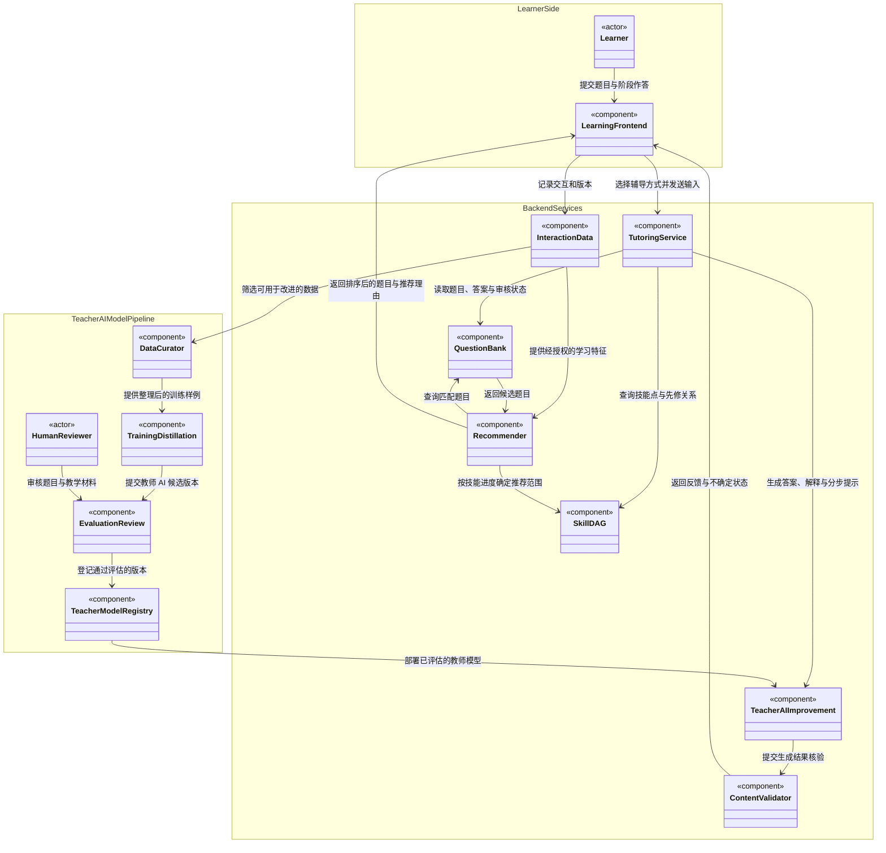

# HACE Lab 项目介绍与工程结构

> 文档定位：这是 HACE Lab 的第一份工程设计文档，描述目标系统的逻辑结构、核心数据流和分阶段建设方向。它是后续开发的基线；尚未落地的部分会标为“规划”或“待决策”，不能据此认为功能已经存在。当前仓库尚未实现前后台应用、题库服务或数据服务。

## 1. 项目目标

HACE Lab 关注人和 AI 在教与学中的协同发展。工程上，项目从 AI 辅助人学习开始，研究学习过程如何帮助改进教师 AI，并将经过评估的改进反馈到人机教学中。

系统要形成可追溯的闭环：

1. 课程知识与经核验的题目支持 AI 分步辅导。
2. 学习者的作答、错误和提示使用情况帮助判断辅导是否有效。
3. 经授权、整理和评估的过程数据用于改进个性化推荐及教师 AI。
4. 经过评估的教师 AI 版本再用于后续辅导，继续检验教学效果。

这是一份工程规划。它不代表过程数据已经能稳定提升模型，也不代表自动评分或蒸馏效果已经得到验证。

## 2. 目标系统结构

UML 组件关系图：

图中节点表示逻辑组件，箭头表示主要调用或数据流。TutoringService 调用 TeacherAIImprovement 生成实时教学内容；教师 AI 改进管线负责筛选授权数据、训练和蒸馏候选版本，并将通过评估的版本部署给生成服务。

| 图中节点 | 职责 |
| --- | --- |
| Learner / HumanReviewer | 学习者 / 人工审核者 |
| LearningFrontend / TutoringService | 学习者前台 / 后台辅导编排 |
| SkillDAG / QuestionBank | 学科技能先修图 / 题目、答案与审核状态 |
| TeacherAIImprovement / ContentValidator | 提示与讲解生成 / 答案和步骤核验 |
| InteractionData / Recommender | 学习过程记录 / 后台选题与排序 |
| DataCurator / TrainingDistillation | 授权数据筛选 / 教师 AI 训练与蒸馏 |
| EvaluationReview / TeacherModelRegistry | 独立评估与人工审核 / 已评估教师 AI 版本 |

以上是逻辑模块图，不是当前代码目录图。技术栈、数据库和服务部署方式待后续设计。

## 3. 后台结构

### 3.1 学科知识库与技能图

知识库先按学科组织。每个学科由技能点构成有向无环图（DAG），用于表示技能之间的先修关系；它不必是一棵树，一个技能可以有多个先修技能，也可能被多个上层技能依赖。

每个技能点至少需要逐步明确：

- 稳定标识、名称、学科和适用课程阶段；
- 技能说明及可观察的掌握目标；
- 先修技能关系；
- 关联题目、题目难度和题型；
- 内容来源、审核状态和版本。

知识图谱是题目组织、学习状态估计和推荐的共同基础。图中边的语义及技能颗粒度需要先通过具体学科试点验证。

### 3.2 题库与答案依据

题目关联一个或多个技能点，并保存题干、题型、适用阶段、来源、版本和审核状态。题库中的标准答案应由教师或领域专家核验；对于开放题，还需要说明可接受的答案范围和评分依据。

需要分别管理：

- **标准答案**：题目结果是否正确；
- **参考解法**：一种经核验的推理路径；
- **分步提示**：帮助学习者继续思考的提示序列；
- **审核与版本记录**：谁核验了什么内容、依据哪个题目版本。

模型生成的题库答案、参考解法和可复用提示先作为草稿，进入正式题库前应经过独立验证和人工审核。对于学习者现场输入题目后生成的实时讲解，可以作为明确标注来源的模型回复提供；它不等于人工审核内容，自动验证结果也应单独记录。

### 3.3 分步提示与讲解生成

后台应支持两种不同的教学请求：

1. **引导解题**：按阶段给提示，优先帮助学习者继续推理，不直接泄露标准答案。
2. **解释已有答案**：学习者提供或选择一个标准答案后，由 AI 解释答案、步骤和所用知识点。

辅导编排服务（TutoringService）调用 TeacherAIImprovement，结合题目、技能目标和学习者当前输入，生成下一步提示、答案或讲解。内容核验模块再检查可验证部分，并记录不确定状态。每次生成需要保留题目版本、提示或模型版本、输入输出及验证状态。提示阶段的划分、每阶段的教学目标和何时展示最终答案，需要在小范围试点中确定。

### 3.4 题目变化与模型行为检查

初步设想是：让模型解原题，再构造保持目标知识不变、但对表述、数量或关系作受控变化的题目，检查模型是否能持续给出正确答案和一致的解题步骤。

这条验证路径仍需拆解。后续至少要定义：

- 哪些变化保持原有知识目标，哪些变化会改变题意或难度；
- 如何独立计算变式题的预期答案；
- 检查哪些字段：答案、数量关系、运算、关键推理步骤及提示质量；
- 如何将失败、未完成和格式错误保留为不同结果；
- 如何使用未参与提示词和规则开发的题目进行独立评估。

通过变式检查只能说明模型在所测题目和变化范围内表现稳定，不能单独证明模型“理解”了题目或具有可靠的教学能力。

### 3.5 如何核验答案

题库题目的答案可以由人保证，这是建立可靠题库的直接起点；但“答案正确”和“解题过程正确”是不同的核验对象。

规划采用分层核验：

- 由教师或领域专家核验题意、标准答案、参考解法和教学提示；
- 对算术、代数结果等可计算部分使用独立程序或求解器复核；
- 对适合形式化表达的数学证明，评估是否引入 Lean 等证明检查工具；
- 将无法自动判定的部分明确标记为待人工判断，不让模型自评替代外部依据。

不建议把 Lean 作为所有题目的前置要求。是否引入、先覆盖哪些可形式化的题型，属于待验证的工程决策；语言题、开放解释和复杂应用题通常仍需要其他核验方式。

## 4. 学习者前台与用户画像

### 4.1 学习者功能

前台规划支持：

- 在明确用途、授权和保存规则的前提下，记录年龄或课程阶段、学习经历及必要的学习偏好；
- 浏览按学科、技能点组织的学习材料和推荐习题；
- 自主输入题目，并选择“分步提示”或“解释标准答案”；
- 分阶段提交自己的思考过程，获得下一步提示和形成性反馈；
- 查看推荐理由，并能选择其他题目或调整练习方向。

年龄和学习记录属于需要谨慎处理的数据。具体收集字段、授权方式和保留期限应在实现账户与事件记录之前确定。

### 4.2 中间输入的形成性评估

学习者每次输入可以由模型辅助评估，例如：

- 是否理解题目要求和已知条件；
- 是否识别相关技能点及其适用条件；
- 当前推理或运算是否成立；
- 下一步适合提供哪一级提示。

评估结果应记录所依据的学习者输入片段、评估维度、模型版本和不确定状态。它是帮助选择后续辅导步骤的估计，不等同于正式成绩或真实掌握程度。信息不足、模型意见不一致或无法可靠判断时，应允许返回“暂无法判断”，而不是强行判对错。

### 4.3 个性化推荐

后台推荐服务根据课程阶段、技能先修关系和经授权的学习历史，从题库检索、筛选并排序候选题目，再将题目和推荐理由返回前台。推荐应帮助形成适合个人的学习进度，同时保留学习者选择和调整的空间，避免仅凭一次错误就固定降低难度或限制可见内容。

推荐所使用的画像数据与模型训练数据应分别定义用途和授权，不能因为数据已被收集就默认可用于训练。

## 5. 学习过程数据与教师 AI 改进

在获得适当授权并完成必要的数据保护后，可以研究学习过程数据能否帮助：

- 找出不同技能点上的常见困难和误解；
- 比较不同讲解、问题和提示对后续作答的影响；
- 改进教师 AI 对不同学习阶段的讲解和提示选择；
- 构造经过筛选的训练样例，探索教师模型训练或蒸馏；

过程记录不能未经整理直接用于模型训练。训练样例需要检查来源、授权、标签质量和重复泄漏；训练效果需要在独立题目、技能和学习者分组上评估。相关性、模型生成的解释和因果效果应分别报告。

建议的事件记录字段包括：匿名或假名化的学习者标识、题目及版本、技能点、展示过的提示、学习者输入、模型评估、模型与提示版本、时间及后续结果。字段是否必要、如何保留及是否可用于推荐或训练，需要逐项定义。

## 6. 工程模块边界

后续代码实现可按以下逻辑职责拆分；这不是对现有目录的描述，也不要求一次性建成所有服务：

| 模块 | 主要职责 |
| --- | --- |
| 学科与技能图 | 学科、技能点、先修 DAG 及版本 |
| 题库管理 | 题目、答案、解法、提示、来源与人工核验 |
| 辅导编排 | 区分引导解题和答案讲解，安排分步交互 |
| 教师 AI 生成服务 | TutoringService 调用 TeacherAIImprovement，生成提示、答案和解释 |
| 内容核验 | 检查答案与步骤、变式行为和形成性评估 |
| 学习者前台 | 题目浏览、推荐、作答、提示和反馈 |
| 学习过程记录 | 保存必要事件、来源、授权和版本信息 |
| 推荐与画像 | 估计技能状态、排序材料、展示推荐依据 |
| 训练与蒸馏实验 | 筛选授权过程数据，训练、评估并发布教师 AI 版本 |
| 评估与审核 | 独立评估模型、答案和教学效果，管理人工审核 |

## 7. 建设顺序建议

1. **先定数据与核验边界**：确定技能图试点范围、题目来源、答案与解法由谁核验、学习数据如何授权和保护。
2. **建立小型知识库和题库**：使用一个学科或一个技能族，明确 DAG、题目和标准答案的数据结构。
3. **落地辅导闭环**：实现题目展示、分步提示、答案讲解、学习者中间输入和可追溯的形成性评估。
4. **验证题目变化和推荐**：先建立可独立核验的变式集，再评估模型行为；用学习结果而不只用作答正确率检查推荐。
5. **开展教师 AI 改进与蒸馏**：在授权、筛选和独立评估条件满足后，再使用学习过程数据训练或蒸馏。

## 8. 后续需要单独设计的事项

- 首个学科、课程范围、技能颗粒度及 DAG 边的定义；
- 题目来源、教师核验流程、开放题的答案与评分标准；
- 分步提示的目标、层级和直接展示答案的条件；
- 受控变式的类别、自动答案校验及独立留出方案；
- Lean 的适用题型、接入成本及其与人工/程序校验的边界；
- 年龄与学习经历数据的最小收集范围、授权、访问和删除策略；
- 推荐有效性、教师 AI 教学效果和蒸馏效果的评价指标；

后续开发应先查阅本文件。新增实现若改变上述模块职责、数据用途或证据边界，应同步修订本文或新增专题文档，并记录尚未解决的决策。
